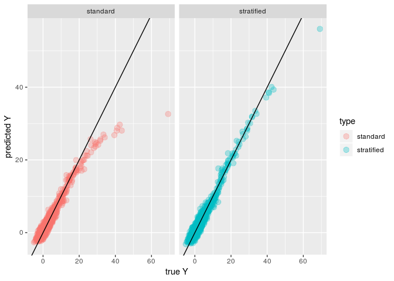
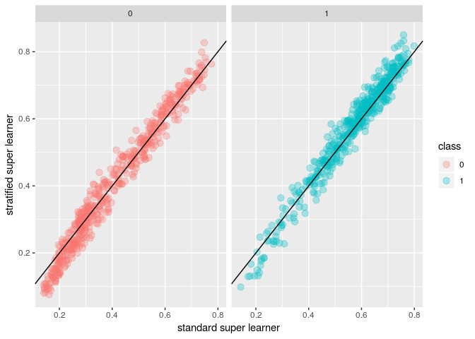

Super learning with stratified weighting
================
[Antoine Chambaz](https://github.com/achambaz), Geoffrey Ecoto, [Eric Polley](https://github.com/ecpolley)
2019-04-26

<!-- 'README.md' is generated from 'README.Rmd'. Please edit that file. -->
Demonstrating the use of the `method.stratifiedNNLS` and `method.stratifiedAUC` Super Learner methods
-----------------------------------------------------------------------------------------------------

> Two new methods to estimate the coefficients for the super learner based on two different loss functions to combine the individual algorithms as an optimal convex combination — namely, the least-squares or the (one minus) area under the curve loss function. In each method, a single algorithm in the library (`SL.stratify` in the examples below) is used to data adaptively identify subgroups in the observed data. The other library algorithms are fit with the full training data, but the weights can vary by subgroup. So this differs from the [subsemble](https://github.com/ledell/subsemble) method in that an overall predictor is fit and the weights can change by subgroup, whereas subsemble estimates subset specific predictors.

Installation
------------

Copy the [method.stratifiedNNLS.R](https://github.com/ecpolley/SuperLearnerExtra/method/method.stratifiedNNLS.R) and [method.stratifiedAUC.R](https://github.com/ecpolley/SuperLearnerExtra/method/method.stratifiedAUC.R) files from the [SuperLearnerExtra](https://github.com/ecpolley/SuperLearnerExtra) repository. Source the files into `R`.

The code below builds upon `?SuperLearner`. We first load the namespace of the package with name `SuperLearner` package, attach it on the search list, and source the file into `R`.

``` r
library(tidyverse)
library(SuperLearner)
## source("https://raw.githubusercontent.com/ecpolley/SuperLearnerExtra/master/method/method.stratifiedNNLS.R")
## source("https://raw.githubusercontent.com/ecpolley/SuperLearnerExtra/master/method/method.stratifiedAUC.R")
set.seed(23432)
```

Using `method.stratifiedNNLS`
-----------------------------

Let's simulate a training set and a test set from a first law.

``` r
simulate_reg <- function(n, p = 10) {
  X <- matrix(rnorm(n * p), nrow = n, ncol = p)
  colnames(X) <- paste0("X", 1:p)
  X <- data.frame(X)
  QX <- X[, 1] + X[, 2] - X[, 3] + sqrt(abs(X[, 2] * X[, 3])) + 
    5 * X[, 4]^2 * (X[, 4] >= -0.1)  
  Y <- QX + rnorm(n)
  list(X = X, Y = Y)
}
## training set
train_reg <- simulate_reg(2e3)
## test set
test_reg <- simulate_reg(1e3)
```

We define a library of algorithms and run the super learner algorithm to obtain a meta-algorithm that performs almost as well as the best algorithm in the library. We rely on the `method.NNLS` method to determine the coefficients for the super learner and the model to combine the individual algorithms.

``` r
## generate library and run Super Learner
SL.library <- c( "SL.mean", "SL.glm", "SL.ksvm", "SL.ranger", "SL.polymars", "SL.gam")

SL_reg <- SuperLearner(Y = train_reg$Y, X = train_reg$X, newX = test_reg$X,
                       SL.library = SL.library,
                       verbose = FALSE, method = "method.NNLS")
```

We would like that the coefficients for the super learner can differ by subgroup. The subgroups are characterized by a stratification algorithm that is encoded just like any other algorithm in the library, see the `functions` `SL.stratify` and `predict.SL.stratify` below (and note that both **must** output `integer`s). Then, the new `method` is obtained through a call to the `method.stratifiedNNLS` `function`.

``` r
## CAUTION: 'SL.stratify' and 'predict.SL.stratify' MUST output integers

SL.stratify <- function(Y, X, newX, family, obsWeights, id, ...) {
  if (!is.matrix(X)) {
    X <- as.matrix(X)
  }
  X <- as.integer(cbind(X[, 4] > 0,
                        X[, 2] * X[, 3] > 0) %*% c(1, 2))
  
  if (!is.matrix(newX)) {
    newX <- as.matrix(newX)
  }
  pred <- as.integer(cbind(newX[, 4] > 0,
                           newX[, 2] * newX[, 3] > 0) %*% c(1, 2))
  fit <- list(object = X)
  out <- list(pred = pred, fit = fit)
  class(out$fit) <- "SL.statify"
  return(out)
}
environment(SL.stratify) <- asNamespace("SuperLearner")


predict.SL.stratify <- function (object, newdata, family, X = NULL, Y = NULL, ...) {
  if (!is.matrix(newdata)) {
    newdata <- as.matrix(newdata)
  }
  pred <- as.integer(cbind(newdata[, 4] > 0,
                           newdata[, 2] * newdata[, 3] > 0) %*% c(1, 2))
  return(pred)
}
environment(predict.SL.stratify) <- asNamespace("SuperLearner")

method.stratif.NNLS <- method.stratifiedNNLS("SL.stratify")
environment(method.stratif.NNLS) <- asNamespace("SuperLearner")
```

To compute the new super learner, it suffices to append the stratification algorithm to the library previously defined, and to request the use of the `method.stratif.NNLS` method.

``` r
SL_stratified_reg <- SuperLearner(Y = train_reg$Y, X = train_reg$X, newX = test_reg$X,
                                  SL.library = c(SL.library, "SL.stratify"),
                                  verbose = FALSE,
                                  method = method.stratif.NNLS)
SL_reg
#> 
#> Call:  
#> SuperLearner(Y = train_reg$Y, X = train_reg$X, newX = test_reg$X, SL.library = SL.library,  
#>     method = "method.NNLS", verbose = FALSE) 
#> 
#> 
#>                      Risk       Coef
#> SL.mean_All     34.266729 0.00000000
#> SL.glm_All      15.701042 0.00000000
#> SL.ksvm_All      4.585417 0.16636839
#> SL.ranger_All    3.125176 0.61280442
#> SL.polymars_All  5.051389 0.15855282
#> SL.gam_All       4.733942 0.06227437
SL_stratified_reg
#> 
#> Call:  
#> SuperLearner(Y = train_reg$Y, X = train_reg$X, newX = test_reg$X, SL.library = c(SL.library,  
#>     "SL.stratify"), method = method.stratif.NNLS, verbose = FALSE) 
#> 
#> 
#>                      Risk           0          1         2           3
#> SL.mean_All     34.254407 0.009031147 0.00000000 0.0000000 0.000000000
#> SL.glm_All      15.667078 0.000000000 0.00000000 0.0000000 0.000000000
#> SL.ksvm_All      4.532907 0.079257210 0.04090472 0.1121455 0.000000000
#> SL.ranger_All    3.071214 0.246894901 0.08580341 0.3134955 0.005892280
#> SL.polymars_All  1.311685 0.460986417 0.87329187 0.3269433 0.988680039
#> SL.gam_All       4.719146 0.203830324 0.00000000 0.2474158 0.005427681
```

The stratum-specific weights differ.

``` r
tib_reg <- tibble(
  predictions = c(SL_reg$SL.predict,
                  SL_stratified_reg$SL.predict),
  Y = rep(test_reg$Y, times = 2),
  type = rep(c("standard", "stratified"), each = length(test_reg$Y)))

tib_reg %>% group_by(type) %>%
  summarize(MSE = mean((Y - predictions)^2))
#> # A tibble: 2 x 2
#>   type         MSE
#>   <chr>      <dbl>
#> 1 standard    3.85
#> 2 stratified  1.48

tib_reg %>% ggplot(aes(x = Y, y = predictions)) +
  geom_point(aes(color = type), size = 3, alpha = 0.3) +
  labs(x = "true Y",
       y = "predicted Y") +
  geom_abline(intercept = 0, slope = 1) +
  facet_wrap(. ~ type)
```



The new super learner (with its stratum-specific weights) performs slightly better than the other one.

Using `method.stratifiedAUC`
----------------------------

Let's simulate another training set and another test set from a second law.

``` r
simulate_class <- function(n, p = 10) {
  X <- matrix(rnorm(n * p), nrow = n, ncol = p)
  colnames(X) <- paste0("X", 1:p)
  X <- data.frame(X)
  QX <- 0.1 + 0.8 *
    pnorm(0.5 * X[, 1] +
          (0.5 + 0.1 * X[, 2]^2) * (X[, 4] > 0) +
          (-1 + X[, 3]) * (X[, 4] <= 0))
  Y <- rbinom(n, 1, QX)
  list(X = X, Y = Y)
}
## training set
train_class <- simulate_class(2e3)
## test set
test_class <- simulate_class(1e3)
```

We run the super learner algorithm to obtain a meta-algorithm that performs almost as well as the best algorithm in a new library. We now rely on the `method.AUC` method to determine the coefficients for the super learner and the model to combine the individual algorithms.

``` r
SL.library <- c( "SL.mean", "SL.glm", "SL.ranger", "SL.qda")

SL_class <- SuperLearner(Y = train_class$Y, X = train_class$X, newX = test_class$X,
                         SL.library = SL.library,
                         verbose = FALSE, method = "method.AUC",
                         family = binomial())
```

We would like that the coefficients for the super learner can differ by subgroup. The subgroups are characterized by a stratification algorithm that is encoded just like any other algorithm in the library, see the `functions` `SL.stratify` and `predict.SL.stratify` below (and note that both **must** output `integer`s). Then, the new `method` is obtained through a call to the `method.stratifiedNNLS` `function`.

``` r
## CAUTION: 'SL.stratify' and 'predict.SL.stratify' MUST output integers

SL.stratify <- function(Y, X, newX, family, obsWeights, id, ...) {
  if (!is.matrix(X)) {
    X <- as.matrix(X)
  }
  X <- as.integer(X[, 4] > 0)
  
  if (!is.matrix(newX)) {
    newX <- as.matrix(newX)
  }
  pred <- as.integer(newX[, 4] > 0)
  fit <- list(object = X)
  out <- list(pred = pred, fit = fit)
  class(out$fit) <- "SL.statify"
  return(out)
}
environment(SL.stratify) <- asNamespace("SuperLearner")

predict.SL.stratify <- function (object, newdata, family, X = NULL, Y = NULL, ...) {
  if (!is.matrix(newdata)) {
    newdata <- as.matrix(newdata)
  }
  pred <- as.integer(newdata[, 4] > 0)
  return(pred)
}
environment(predict.SL.stratify) <- asNamespace("SuperLearner")

method.stratif.AUC <- method.stratifiedAUC("SL.stratify", optim_method = "Nelder-Mead")
environment(method.stratif.AUC) <- asNamespace("SuperLearner")
```

To compute the new super learner, it suffices to append the stratification algorithm to the library previously defined, and to request the use of the `method.stratif.AUC` method.

``` r
## debug(method.stratif.AUC$computeCoef)
SL_stratified_class <- SuperLearner(Y = train_class$Y, X = train_class$X, newX = test_class$X,
                                    SL.library = c(SL.library, "SL.stratify"),
                                    verbose = FALSE,
                                    method = method.stratif.AUC,
                                    family = binomial())
SL_class
#> 
#> Call:  
#> SuperLearner(Y = train_class$Y, X = train_class$X, newX = test_class$X,  
#>     family = binomial(), SL.library = SL.library, method = "method.AUC",  
#>     verbose = FALSE) 
#> 
#> 
#>                    Risk       Coef
#> SL.mean_All   0.5340306 0.19179168
#> SL.glm_All    0.2697137 0.04108091
#> SL.ranger_All 0.2378826 0.53229180
#> SL.qda_All    0.2594415 0.23483561
SL_stratified_class
#> 
#> Call:  
#> SuperLearner(Y = train_class$Y, X = train_class$X, newX = test_class$X,  
#>     family = binomial(), SL.library = c(SL.library, "SL.stratify"),  
#>     method = method.stratif.AUC, verbose = FALSE) 
#> 
#> 
#>                    Risk          0          1
#> SL.mean_All   0.5496447 0.06702585 0.17636040
#> SL.glm_All    0.2719448 0.12253402 0.06066749
#> SL.ranger_All 0.2374037 0.38236493 0.66881139
#> SL.qda_All    0.2597548 0.42807520 0.09416073
```

Here too, the stratum-specific weights differ.

``` r
compute_auc <- function(preds, labs) {
  1 - cvAUC(preds, labs)$cvAUC
}

tib_class <- tibble(
  standard = as.vector(SL_class$SL.predict),
  stratified = SL_stratified_class$SL.predict,
  class = factor(test_class$Y))

tib_class %>% summarize(auc_class = compute_auc(standard, class),
                        auc_stratified_class = compute_auc(stratified, class))
#> # A tibble: 1 x 2
#>   auc_class auc_stratified_class
#>       <dbl>                <dbl>
#> 1     0.248                0.249

tib_class %>% ggplot(aes(x = standard, y = stratified)) +
  geom_point(aes(color = class), size = 3, alpha = 0.3) +
  labs(x = "standard super learner",
       y = "stratified super learner") +
  geom_abline(intercept = 0, slope = 1) +
  facet_wrap(. ~ class)
```



However, the new super learner (with its stratum-specific weights) and the other one perform similarly.
